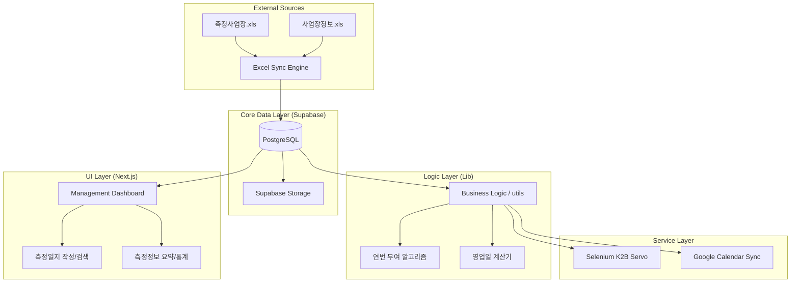

# Architecture Guide - 측정일지 관리 시스템

본 시스템은 '1-Source Multi-Use (1SMU)' 철학에 기반하여, 한 번의 엑셀 데이터 연동으로 측정일지, K2B 전송, 사업장 관리, 성과 관리까지 연쇄적으로 처리하는 아키텍처를 가집니다.

## 1. High-Level Architecture

## 2. Data Lifecycle

1.  **Ingestion**: `lib/sync/excel-sync.ts`를 통해 로컬 엑셀 파일을 읽어 `measurement_business` 및 `business_info` 테이블로 동기화.
2.  **Processing**: 동기화된 데이터를 바탕으로 `measurement_journal`을 생성하거나 빈 필드를 'Latest Wins' 원칙에 따라 보정.
3.  **Automation**: 작성된 측정일지 데이터를 기반으로 Selenium을 구동하여 K2B 고용노동부 전산망에 자동 입력.
4.  **Reporting**: Google Calendar 및 대시보드 통계를 통해 성과 및 정합성 검증.

## 3. 핵심 설계 원칙

-   **Single Source of Truth**: 엑셀 데이터가 시스템의 근간이며, 모든 보정 로직은 엑셀 원본성을 우선함.
-   **Atomic Operations**: 연번 부여 및 데이터 동기화는 트랜잭션 또는 무결성 검증 단계를 거쳐 중복 발생을 억제함.
-   **Data Synchronization Guarantee**: 합계 필드(`deposit_total` 등)는 반드시 개별 구성 항목들의 실시간 합산 결과와 일치해야 하며, 모든 업로드/수정 API는 이를 강제해야 함.
-   **Guard Clauses**: 지청별 예외 로직(발행일 등)이나 권한 체크는 함수 시작부에서 명시적으로 격리함.

## 4. 데이터 정합성 관리 규칙 (매출/입금)

본 시스템은 매출액 및 입금액의 정확성을 보장하기 위해 다음과 같은 엄격한 정합성 규칙을 적용합니다.

1.  **Atomic Payment Update**: 
    - 국고 지원금 정산(`payment-status`) 또는 일반 엑셀 업로드 시, 개별 입금액(`deposit_amount_business`, `deposit_amount_national`)이 변경되면 반드시 `deposit_total`을 재계산하여 업데이트함.
    - 서버 사이드 API 레벨에서 합산 로직을 처리하여 클라이언트 데이터의 오차를 원천 차단함.
2.  **Reporting Consistency**:
    - **표 1(년도별 집계 현황)**과 **표 2(입금 및 미수금 현황)**는 항상 동일한 최종 합계 수치를 보여야 함.
    - 표 1은 빠른 조회를 위해 DB의 합계 필드(`deposit_total`)를 사용하고, 표 2는 상세 분석을 위해 개별 필드를 사용하되, 두 필드의 값은 항상 동기화된 상태를 유지함.
3.  **Auditability**:
    - `scripts/full-audit-2026.ts`와 같은 검증 스크립트를 통해 주기적으로 DB 내의 합계 필드 정합성을 전수 조사하고 보정할 수 있는 환경을 유지함.

# System Dependency Graph (Graphify Context)

이 문서는 AI 에이전트가 시스템 구조를 입체적으로 파악하고 '문맥 썩음(Context Rot)'을 방지하기 위한 핵심 의존성 그래프입니다. 코드를 수정할 때 반드시 아래 연결망을 확인하고 Side-Effect를 검토하세요.

## 1. Core Dependency Mapping (Graph)

- **[UI Layer]** `SalesManagement.tsx` 
  - ↳ 포함: `StatTables.tsx` (데이터 시각화 위임)
  - ↳ 의존: `/api/sales` 및 `/api/journal` (데이터 패칭)
  - ⚠️ 주의: UI에서 합계(deposit_total 등)를 직접 계산하지 않고 DB의 값을 신뢰함.

- **[Logic Layer]** `number-assignment.ts`
  - ↳ 대상: `measurement_journal` 테이블
  - ↳ 역할: 공문연번, 연번, 5인 이상 연번 Atomic 부여
  - ⚠️ 규칙: 지정지청별/년도별 조합으로 고유성을 보장하며, 중복 시 자동 증가 로직(`while` 루프) 포함.

- **[Logic Layer]** `sync-service.ts` (Calendar)
  - ↳ 대상: `measurement_target_business`, `preliminary_survey`
  - ⚠️ 규칙: 덮어쓰기 방지를 위해 설명란에 `사업장코드: ${code}`를 반드시 박제하고 검증함.

- **[Data Layer]** `Supabase (PostgreSQL)`
  - ↳ 핵심 테이블: `measurement_journal` (가장 많은 관계를 가짐. K2B, 연번, 계산서 발행의 기준점)

## 2. AI Agent 행동 지침 (Rule of Graph)

1. **연쇄 수정 원칙**: `measurement_journal` DB 스키마나 쿼리를 수정할 경우, 이에 의존하는 `number-assignment.ts`(연번)와 `k2b-service.ts`(전송), `StatTables.tsx`(통계)의 파급 효과를 반드시 먼저 시뮬레이션할 것.
2. **모듈 격리**: UI 파일(`SalesManagement.tsx`) 내부에 복잡한 비즈니스 로직(예: 연번 부여, 구글 API 호출)을 직접 작성하지 말고, 반드시 `lib/` 폴더의 서비스 모듈로 분리하여 Graph의 Node를 분산시킬 것.