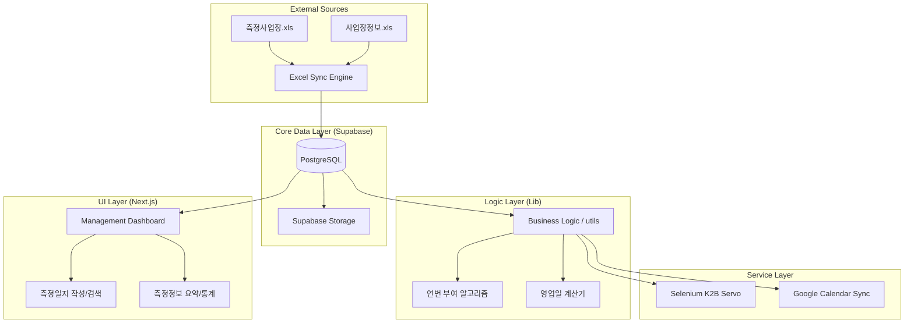

# Architecture Guide - 측정일지 관리 시스템

본 시스템은 '1-Source Multi-Use (1SMU)' 철학에 기반하여, 한 번의 엑셀 데이터 연동으로 측정일지, K2B 전송, 사업장 관리, 성과 관리까지 연쇄적으로 처리하는 아키텍처를 가집니다.

## 1. High-Level Architecture

## 2. Data Lifecycle

1.  **Ingestion**: `lib/sync/excel-sync.ts`를 통해 로컬 엑셀 파일을 읽어 `measurement_business` 및 `business_info` 테이블로 동기화.
2.  **Processing**: 동기화된 데이터를 바탕으로 `measurement_journal`을 생성하거나 빈 필드를 'Latest Wins' 원칙에 따라 보정.
3.  **Automation**: 작성된 측정일지 데이터를 기반으로 Selenium을 구동하여 K2B 고용노동부 전산망에 자동 입력.
4.  **Reporting**: Google Calendar 및 대시보드 통계를 통해 성과 및 정합성 검증.

## 3. 핵심 설계 원칙

-   **Single Source of Truth**: 엑셀 데이터가 시스템의 근간이며, 모든 보정 로직은 엑셀 원본성을 우선함.
-   **Atomic Operations**: 연번 부여 및 데이터 동기화는 트랜잭션 또는 무결성 검증 단계를 거쳐 중복 발생을 억제함.
-   **Guard Clauses**: 지청별 예외 로직(발행일 등)이나 권한 체크는 함수 시작부에서 명시적으로 격리함.
