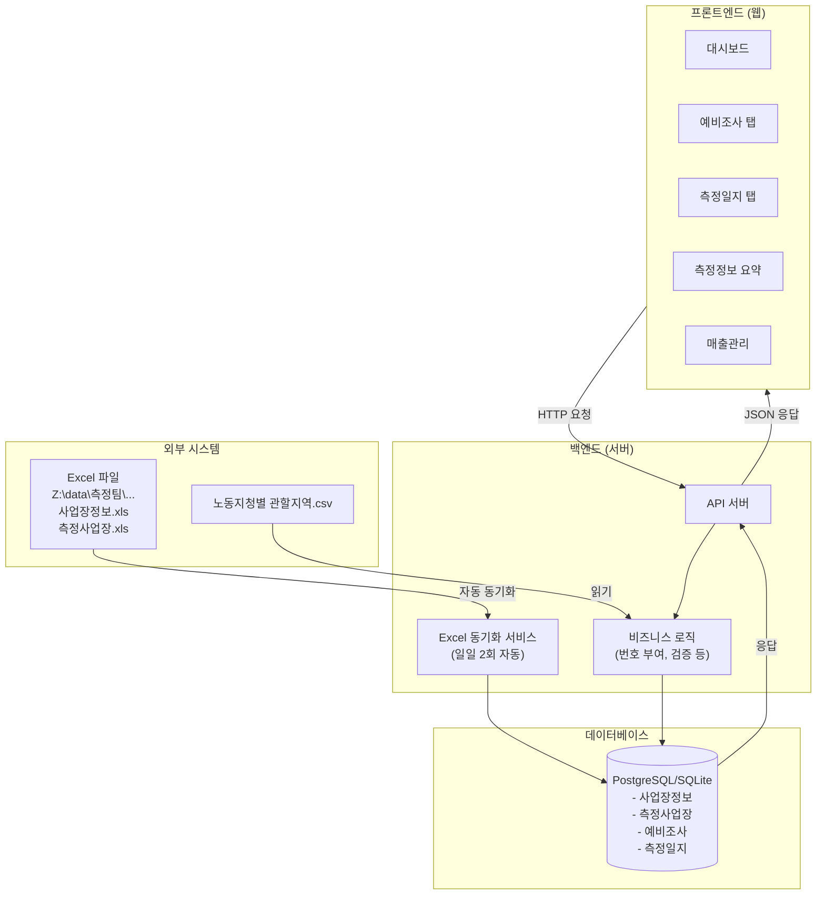

# TRD (기술 요구사항 정의서)

**프로젝트명**: 측정일지 관리 시스템  
**버전**: v1.0  
**작성일**: 2025-01-27

---

## 1. 시스템 아키텍처

### 1.1 전체 시스템 구조

### 1.2 데이터 흐름

1. **Excel 동기화 흐름**:
   - Excel 파일 변경 감지 (파일 모니터링 또는 스케줄러)
   - Excel 파일 파싱 (openpyxl 또는 pandas)
   - 데이터베이스 업데이트
   - 동기화 상태 로그 기록

2. **사용자 작업 흐름**:
   - 사용자 요청 → API 서버
   - 비즈니스 로직 처리 (번호 부여, 검증 등)
   - 데이터베이스 조회/수정
   - 응답 반환

---

## 2. 권장 기술 스택

### 2.1 프론트엔드

**선택 기술**: **Next.js 14+ (React 기반)**

**선택 이유**:
- 서버 사이드 렌더링(SSR) 지원으로 초기 로딩 속도 향상
- 파일 기반 라우팅으로 간단한 구조 유지
- API Routes 내장으로 백엔드와 통합 용이
- TypeScript 지원으로 타입 안정성 확보
- Vercel 배포와 완벽한 통합 (무료 티어 제공)
- 대규모 커뮤니티 및 풍부한 문서

**대안**:
- **React + Vite**: 더 가벼운 번들 크기, 하지만 SSR 설정 필요
- **Vue.js + Nuxt**: React 대안, 하지만 Next.js보다 생태계 작음

**벤더 락인 리스크**: 낮음 (React는 오픈소스, Next.js도 오픈소스)

**추가 라이브러리**:
- **Tailwind CSS**: 유틸리티 기반 CSS 프레임워크 (빠른 스타일링)
- **React Hook Form**: 폼 관리 및 검증
- **Zustand 또는 React Query**: 상태 관리 및 서버 상태 관리

### 2.2 백엔드

**선택 기술**: **Next.js API Routes + Python (FastAPI) 하이브리드**

**주요 백엔드**: **Next.js API Routes**
- 프론트엔드와 같은 프로젝트에서 관리 가능
- 서버리스 함수로 자동 스케일링
- Vercel 배포 시 무료 티어 활용 가능

**Excel 처리 전용**: **Python (FastAPI)**
- Excel 파일 처리에 최적화된 라이브러리 (openpyxl, pandas)
- 복잡한 비즈니스 로직 처리 용이
- 별도 마이크로서비스로 분리 가능

**선택 이유**:
- Excel 파일 처리는 Python이 가장 강력함
- Next.js API Routes로 간단한 CRUD는 빠르게 처리
- 서버리스 아키텍처로 비용 최소화

**대안**:
- **Node.js + Express**: JavaScript 통일, 하지만 Excel 처리 라이브러리 제한적
- **Python Django**: 풀스택 프레임워크, 하지만 오버엔지니어링 가능성

**벤더 락인 리스크**: 낮음 (모두 오픈소스)

**추가 라이브러리**:
- **openpyxl**: Excel 파일 읽기/쓰기
- **pandas**: 데이터 처리 및 변환
- **schedule**: 스케줄링 (일일 2회 동기화)

### 2.3 데이터베이스

**선택 기술**: **PostgreSQL (Supabase 무료 티어)**

**선택 이유**:
- **Supabase 무료 티어**: 
  - 500MB 데이터베이스
  - 2GB 대역폭
  - 실시간 기능 포함
  - 자동 백업
  - REST API 자동 생성
- 관계형 데이터베이스로 복잡한 쿼리 처리 가능
- 트랜잭션 지원으로 데이터 무결성 보장
- 확장성 우수 (나중에 유료 플랜으로 업그레이드 가능)

**대안**:
- **SQLite**: 파일 기반, 무료, 하지만 동시 접속 제한 (10명 사용자에게는 적합할 수 있음)
- **Firebase Firestore**: NoSQL, 실시간 기능 강력, 하지만 쿼리 제한적

**벤더 락인 리스크**: 중간 (Supabase는 오픈소스이지만 호스팅은 벤더 의존)

**마이그레이션 전략**: 
- 초기에는 SQLite로 시작하여 개발/테스트
- 프로덕션은 Supabase PostgreSQL 사용
- 필요 시 다른 PostgreSQL 호스팅으로 마이그레이션 가능

### 2.4 배포/호스팅

**선택 플랫폼**: **Vercel (프론트엔드) + Railway/Render (백엔드 Python)**

**Vercel (프론트엔드 + Next.js API)**:
- **무료 티어**: 
  - 무제한 개인 프로젝트
  - 100GB 대역폭/월
  - 자동 HTTPS
  - 글로벌 CDN
- Next.js와 완벽한 통합
- Git 연동으로 자동 배포

**Railway 또는 Render (Python 백엔드)**:
- **Railway 무료 티어**: $5 크레딧/월 (제한적)
- **Render 무료 티어**: 제한적이지만 기본 사용 가능
- **대안**: Python 백엔드를 Next.js API Routes로 통합하여 Vercel만 사용 (권장)

**예상 비용**:
- **초기 (무료 티어)**: $0/월
- **성장 시 (Supabase Pro)**: $25/월 (필요 시)
- **확장 시**: 사용량 기반 과금

**확장 전략**:
1. 초기: Vercel 무료 티어 + Supabase 무료 티어
2. 성장: Supabase Pro ($25/월)로 업그레이드
3. 대규모: Vercel Pro + Supabase Enterprise

### 2.5 외부 API/서비스

**현재 연동 계획 없음**

**향후 확장 가능성**:
- 이메일 발송: SendGrid (무료 티어: 100건/일)
- 파일 저장: AWS S3 또는 Supabase Storage (무료 티어 있음)

---

## 3. 비기능적 요구사항

### 3.1 성능

- **응답 시간**: 
  - 페이지 로딩: 2초 이내
  - 검색 작업: 3초 이내
  - 저장 작업: 3초 이내
- **동시 접속**: 최소 10명 동시 접속 지원
- **처리량**: 초당 최소 10건의 요청 처리

### 3.2 보안

- **인증**: 기본 세션 기반 인증 (향후 JWT 고려)
- **권한 관리**: 역할 기반 접근 제어 (RBAC)
- **데이터 암호화**: 
  - 전송 중: HTTPS 필수
  - 저장 시: 데이터베이스 암호화
- **입력 검증**: 모든 사용자 입력 검증 및 Sanitization
- **SQL Injection 방지**: ORM 사용 또는 파라미터화된 쿼리

### 3.3 확장성

- **수평 확장**: 서버리스 아키텍처로 자동 확장
- **데이터베이스 확장**: 인덱싱 최적화, 쿼리 최적화
- **캐싱 전략**: 
  - 정적 데이터: CDN 캐싱
  - 동적 데이터: Redis 캐싱 (필요 시)

### 3.4 가용성

- **목표 가동률**: 99% 이상
- **백업**: 일일 자동 백업 (Supabase 기본 제공)
- **재해 복구**: 백업에서 복구 가능

### 3.5 유지보수성

- **코드 품질**: TypeScript 사용, ESLint, Prettier
- **문서화**: API 문서, 코드 주석
- **로깅**: 구조화된 로그 기록
- **모니터링**: 에러 추적 및 성능 모니터링 (Sentry 무료 티어)

---

## 4. 데이터베이스 요구사항

### 4.1 스키마 설계 원칙

- **정규화**: 3NF 이상 유지
- **인덱싱 전략**: 
  - 검색에 자주 사용되는 컬럼에 인덱스 생성
  - 외래키에 인덱스 생성
  - 복합 인덱스 활용 (측정년도 + 측정주기 등)
- **데이터 무결성**: 
  - 외래키 제약조건
  - NOT NULL 제약조건
  - UNIQUE 제약조건 (공문연번, 연번 등)

### 4.2 주요 테이블

1. **사업장정보** (business_info)
2. **측정사업장** (measurement_business)
3. **예비조사** (preliminary_survey)
4. **측정일지** (measurement_journal) - 가장 중요

### 4.3 인덱싱 전략

**측정일지 테이블**:
- `(측정년도, 측정주기)` - 복합 인덱스
- `사업장명` - 검색 최적화
- `지정한계_관할지청` - 필터링 최적화
- `완료여부` - 대시보드 쿼리 최적화

**예비조사 테이블**:
- `측정일` - 날짜 범위 검색
- `사업장명` - 검색 최적화

---

## 5. 접근제어·권한 모델

### 5.1 역할 정의

- **관리자**: 모든 기능 접근, 시스템 설정
- **측정팀 직원**: 측정일지 작성/수정, 예비조사 입력, 조회

### 5.2 권한 정책

| 기능 | 관리자 | 측정팀 직원 |
|------|--------|------------|
| 측정일지 조회 | ✅ | ✅ |
| 측정일지 수정 | ✅ | ✅ |
| 측정일지 삭제 | ✅ | ❌ |
| 예비조사 입력 | ✅ | ✅ |
| 대시보드 조회 | ✅ | ✅ |
| 매출 관리 | ✅ | ✅ |
| 시스템 설정 | ✅ | ❌ |
| 사용자 관리 | ✅ | ❌ |

### 5.3 데이터 접근 제어

- **완료된 측정일지**: 수정 불가 (완료여부 = "완료")
- **자동 생성 필드**: 공문연번, 연번, 5인 이상 연번은 수정 불가
- **동시 편집 방지**: 낙관적 잠금 (Optimistic Locking) 또는 실시간 편집 상태 표시

---

## 6. 데이터 생명주기

### 6.1 수집 원칙

- **최소 수집**: 업무에 필요한 최소한의 데이터만 수집
- **자동 수집**: Excel 파일에서 자동으로 동기화
- **사용자 입력**: 측정일지 수정, 예비조사 입력 등

### 6.2 보존 기간

- **측정일지**: 영구 보존 (법적 요구사항 고려)
- **예비조사**: 5년 보존
- **로그 데이터**: 1년 보존

### 6.3 삭제/익명화 경로

- **삭제 요청**: 관리자 승인 필요
- **익명화**: 개인정보 포함 필드만 익명화 처리
- **백업 보존**: 삭제 후에도 백업에 1년간 보존 (법적 요구사항)

---

## 7. Excel 동기화 아키텍처

### 7.1 동기화 방식

**옵션 1: 파일 모니터링 (권장)**
- 파일 시스템 이벤트 감지
- 파일 변경 시 자동 동기화
- 실시간 반영

**옵션 2: 스케줄러 기반**
- 일일 2회 (예: 오전 9시, 오후 6시) 자동 실행
- Cron Job 또는 스케줄러 사용

**옵션 3: 수동 동기화**
- 사용자가 버튼 클릭으로 동기화
- 자동 동기화 실패 시 대안

### 7.2 동기화 프로세스

1. Excel 파일 읽기 (openpyxl)
2. 데이터 파싱 및 검증
3. 데이터베이스 트랜잭션 시작
4. 기존 데이터와 비교 (변경사항 감지)
5. 데이터베이스 업데이트
6. 동기화 로그 기록
7. 사용자에게 알림 (선택적)

### 7.3 오류 처리

- **파일 읽기 실패**: 재시도 메커니즘 (최대 3회)
- **데이터 형식 오류**: 로그 기록 및 관리자 알림
- **동기화 실패**: 부분 업데이트 방지 (트랜잭션 롤백)

---

## 8. 비용 분석

### 8.1 초기 비용 (무료 티어)

| 서비스 | 비용 | 제한사항 |
|--------|------|----------|
| Vercel | $0/월 | 100GB 대역폭/월 |
| Supabase | $0/월 | 500MB DB, 2GB 대역폭 |
| 도메인 | $0/월 | Vercel 기본 도메인 사용 |
| **총계** | **$0/월** | |

### 8.2 성장 시 비용 (필요 시)

| 서비스 | 비용 | 업그레이드 이유 |
|--------|------|----------------|
| Supabase Pro | $25/월 | 더 큰 데이터베이스, 더 많은 대역폭 |
| Vercel Pro | $20/월 | 더 많은 빌드 시간, 팀 기능 |
| **총계** | **$45/월** | |

### 8.3 비용 최적화 전략

1. **무료 티어 최대 활용**: 초기에는 무료 티어로 시작
2. **사용량 모니터링**: 대역폭 및 저장공간 사용량 추적
3. **캐싱 활용**: CDN 및 캐싱으로 대역폭 절감
4. **데이터 최적화**: 불필요한 데이터 정리, 압축

---

## 9. 기술 스택 요약

| 계층 | 기술 | 버전 | 비용 |
|------|------|------|------|
| 프론트엔드 | Next.js | 14+ | 무료 |
| 스타일링 | Tailwind CSS | 3+ | 무료 |
| 백엔드 | Next.js API Routes | 14+ | 무료 |
| Excel 처리 | Python (FastAPI) | 3.11+ | 무료 |
| 데이터베이스 | PostgreSQL (Supabase) | 15+ | 무료 (초기) |
| 배포 | Vercel | - | 무료 (초기) |
| 모니터링 | Sentry | - | 무료 티어 |

---

## 10. 리스크 및 대응

| 리스크 | 완화 전략 |
|--------|-----------|
| Excel 파일 형식 변경 | 유연한 파싱 로직, 형식 변경 감지 및 알림 |
| Supabase 무료 티어 초과 | 사용량 모니터링, 데이터 최적화, 필요 시 유료 플랜 |
| 동시 접속 시 성능 저하 | 데이터베이스 인덱싱, 쿼리 최적화, 캐싱 |
| 파일 동기화 실패 | 자동 재시도, 수동 동기화 버튼, 로그 기록 |

