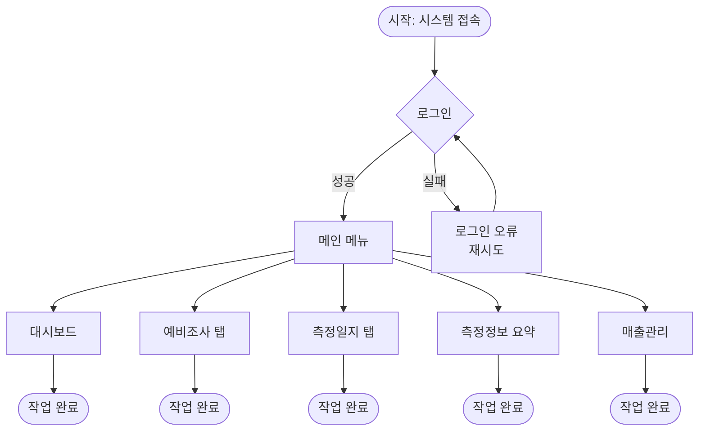
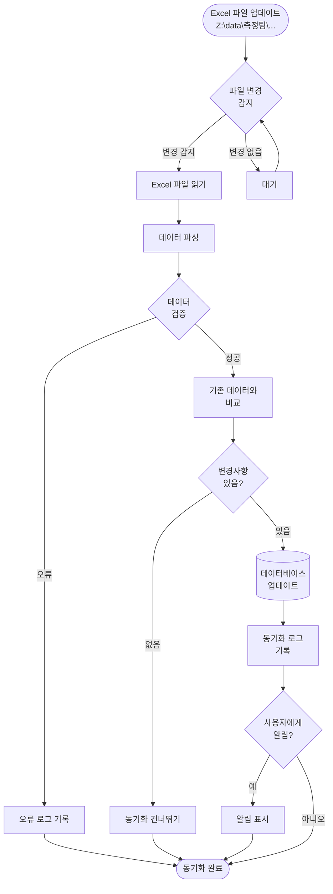
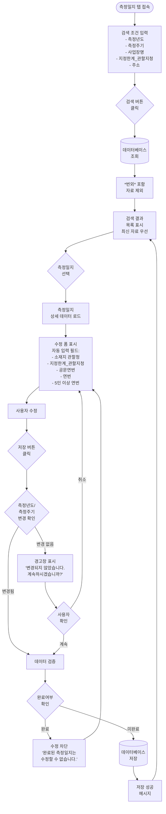
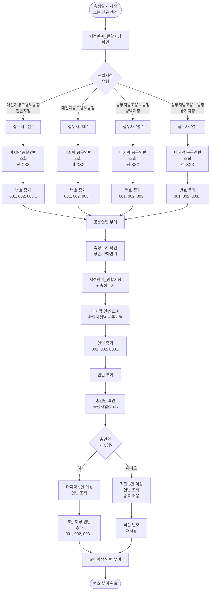
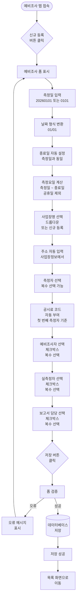
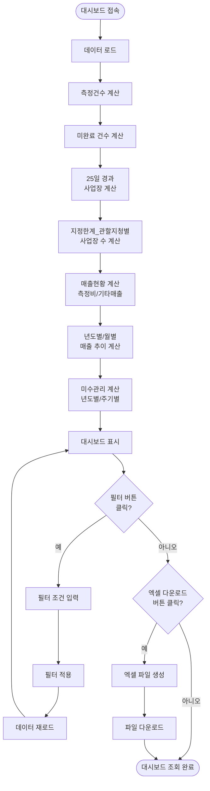
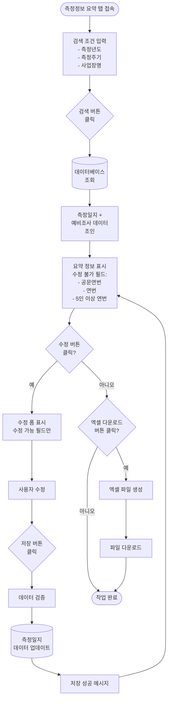
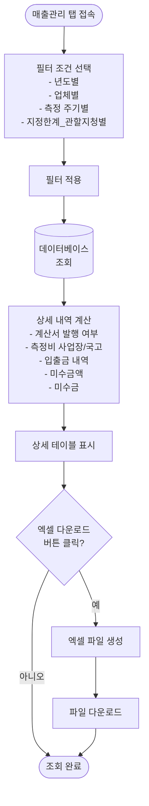
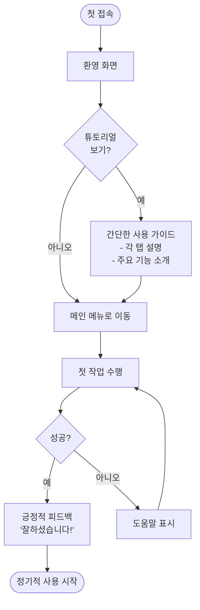

# User Flow (사용자 흐름도)

**프로젝트명**: 측정일지 관리 시스템  
**버전**: v1.0  
**작성일**: 2025-01-27

---

## 1. 전체 사용자 여정 개요

---

## 2. FEAT-1: Excel 자동 동기화 흐름

---

## 3. FEAT-2: 측정일지 검색 및 수정 흐름

---

## 4. FEAT-3: 공문연번/연번 자동 부여 흐름

---

## 5. 예비조사 입력 흐름

---

## 6. 대시보드 조회 흐름

---

## 7. 측정정보 요약 조회 및 수정 흐름

---

## 8. 매출관리 조회 흐름

---

## 9. 성공 및 실패 분기

### 9.1 성공 루프 (Sticky Loop)

사용자가 성공적으로 작업을 완료한 후 다시 시스템을 사용하게 만드는 요소:

1. **즉각적인 피드백**: 저장 성공 메시지, 데이터 업데이트 확인
2. **편리한 검색**: 빠른 검색으로 필요한 정보 즉시 확인
3. **자동화된 처리**: 번호 부여 등 복잡한 작업 자동 처리
4. **실시간 동기화**: 최신 데이터 항상 확인 가능

### 9.2 실패 분기 처리

- **검색 결과 없음**: "검색 결과가 없습니다. 다른 조건으로 검색해주세요."
- **저장 실패**: "저장에 실패했습니다. 다시 시도해주세요."
- **권한 없음**: "이 작업을 수행할 권한이 없습니다."
- **완료된 측정일지 수정 시도**: "완료된 측정일지는 수정할 수 없습니다."

---

## 10. 온보딩 흐름 (초기 사용자)

