# Database Design (데이터베이스 설계)

**프로젝트명**: 측정일지 관리 시스템  
**버전**: v1.0  
**작성일**: 2025-01-27

---

## 1. ERD (Entity Relationship Diagram)

```mermaid
erDiagram
    BUSINESS_INFO ||--o{ MEASUREMENT_BUSINESS : "참조"
    MEASUREMENT_BUSINESS ||--o{ MEASUREMENT_JOURNAL : "생성"
    MEASUREMENT_BUSINESS ||--o{ PRELIMINARY_SURVEY : "참조"
    MEASUREMENT_JOURNAL ||--o{ MEASUREMENT_SUMMARY : "요약"
    PRELIMINARY_SURVEY ||--o{ MEASUREMENT_SUMMARY : "요약"
    
    BUSINESS_INFO {
        string code PK
        string business_name
        string business_number
        string address1
        string address2
        string phone
        string fax
        string representative_name
        datetime created_at
        datetime updated_at
    }
    
    MEASUREMENT_BUSINESS {
        string code PK
        int year
        string period
        string business_name
        string business_number
        string total_employees
        string address
        string office_jurisdiction
        date measurement_start_date
        date measurement_end_date
        string completion_status
        string measurer
        string commencement_number
        datetime created_at
        datetime updated_at
    }
    
    MEASUREMENT_JOURNAL {
        int id PK
        string code FK
        int measurement_year
        string measurement_period
        string note
        string designated_office
        string document_number
        string sequence_number
        string five_plus_sequence
        date measurement_start_date
        date measurement_end_date
        string completion_status
        string measurer
        string office_jurisdiction
        string business_name
        int total_employees
        string business_number
        string industrial_accident_number
        string representative_name
        string national_support_status
        string address
        string phone
        string fax
        string manager_name
        string manager_position
        string manager_mobile
        string manager_email
        date k2b_send_date
        string k2b_sender
        string invoice_email
        date electronic_invoice_date
        decimal measurement_fee_total
        decimal measurement_fee_business
        decimal measurement_fee_national
        decimal deposit_total
        date deposit_date_business
        decimal deposit_amount_business
        date deposit_date_national
        decimal deposit_amount_national
        text special_notes
        datetime created_at
        datetime updated_at
        string created_by
        string updated_by
    }
    
    PRELIMINARY_SURVEY {
        int id PK
        string code FK
        date measurement_date
        date end_date
        string measurement_weekdays
        string business_name
        string measurer
        string survey_code
        string address
        string preliminary_surveyor
        string actual_measurer
        string report_writer
        datetime created_at
        datetime updated_at
        string created_by
    }
    
    MEASUREMENT_SUMMARY {
        int id PK
        int journal_id FK
        int survey_id FK
        string code
        int measurement_year
        string measurement_period
        string note
        string document_number
        string sequence_number
        string five_plus_sequence
        date measurement_start_date
        date measurement_end_date
        string measurer
        string preliminary_surveyor
        string survey_code
        string office_jurisdiction
        string business_name
        int total_employees
        string business_number
        string industrial_accident_number
        string national_support_status
        string manager_name
        string manager_position
        string manager_mobile
        string manager_email
        date k2b_send_date
        string k2b_sender
        decimal measurement_fee_business
        datetime created_at
        datetime updated_at
    }
    
    SYNC_LOG {
        int id PK
        string file_name
        string sync_type
        datetime sync_start_time
        datetime sync_end_time
        string status
        int records_processed
        int records_updated
        int records_inserted
        text error_message
        datetime created_at
    }
```

---

## 2. 테이블 상세 설계

### 2.1 사업장정보 (business_info)

**목적**: 사업장의 기본 정보를 저장하는 마스터 테이블

| 컬럼명 | 데이터 타입 | 제약조건 | 설명 |
|--------|------------|----------|------|
| code | VARCHAR(50) | PK, NOT NULL | 사업장 코드 (고유 식별자) |
| business_name | VARCHAR(200) | NOT NULL | 사업장명 |
| business_number | VARCHAR(20) | | 사업자번호 |
| address1 | VARCHAR(500) | | 주소1 |
| address2 | VARCHAR(500) | | 주소2 |
| phone | VARCHAR(20) | | 전화번호 |
| fax | VARCHAR(20) | | FAX |
| representative_name | VARCHAR(100) | | 대표자명 |
| created_at | TIMESTAMP | NOT NULL, DEFAULT NOW() | 생성일시 |
| updated_at | TIMESTAMP | NOT NULL, DEFAULT NOW() | 수정일시 |

**인덱스**:
- `idx_business_info_code`: code (PK)
- `idx_business_info_name`: business_name (검색 최적화)

**데이터 소스**: 사업장정보.xls

---

### 2.2 측정사업장 (measurement_business)

**목적**: 측정 대상 사업장 정보를 저장

| 컬럼명 | 데이터 타입 | 제약조건 | 설명 |
|--------|------------|----------|------|
| code | VARCHAR(50) | PK, NOT NULL | 측정사업장 코드 |
| year | INT | NOT NULL | 측정년도 |
| period | VARCHAR(10) | NOT NULL | 측정주기 (상반기/하반기) |
| business_name | VARCHAR(200) | NOT NULL | 사업장명 |
| business_number | VARCHAR(20) | CHECK (10자 숫자) | 사업자번호 |
| total_employees | INT | | 총인원 |
| address | VARCHAR(500) | | 주소 |
| office_jurisdiction | VARCHAR(100) | | 소재지 관할청 |
| measurement_start_date | DATE | | 측정 시작일 |
| measurement_end_date | DATE | | 측정 종료일 |
| completion_status | VARCHAR(20) | | 완료여부 (완료/미완료) |
| measurer | VARCHAR(100) | | 측정자 |
| industrial_accident_number | VARCHAR(50) | CHECK (11자 숫자) | 산재관리번호 |
| commencement_number | VARCHAR(50) | CHECK (11자 숫자) | 개시번호 |
| created_at | TIMESTAMP | NOT NULL, DEFAULT NOW() | 생성일시 |
| updated_at | TIMESTAMP | NOT NULL, DEFAULT NOW() | 수정일시 |

**인덱스**:
- `idx_measurement_business_code`: code (PK)
- `idx_measurement_business_year_period`: (year, period) (복합 인덱스)
- `idx_measurement_business_name`: business_name
- `idx_measurement_business_status`: completion_status

**데이터 소스**: 측정사업장.xls

---

### 2.3 측정일지 (measurement_journal)

**목적**: 측정일지의 모든 정보를 저장하는 핵심 테이블

| 컬럼명 | 데이터 타입 | 제약조건 | 설명 |
|--------|------------|----------|------|
| id | INT | PK, AUTO_INCREMENT | 측정일지 ID |
| code | VARCHAR(50) | FK, NOT NULL | 측정사업장 코드 |
| measurement_year | INT | NOT NULL | 측정년도 |
| measurement_period | VARCHAR(10) | NOT NULL | 측정주기 |
| note | VARCHAR(50) | | 비고 (최초실시/고시물질/소음 85 이상) |
| designated_office | VARCHAR(100) | NOT NULL | 지정한계_관할지청 |
| document_number | VARCHAR(20) | UNIQUE | 공문연번 (자동 생성, 수정 불가) |
| sequence_number | VARCHAR(10) | | 연번 (자동 생성, 수정 불가) |
| five_plus_sequence | VARCHAR(10) | | 5인 이상 연번 (자동 생성, 수정 불가) |
| measurement_start_date | DATE | | 측정 시작일 |
| measurement_end_date | DATE | | 측정 종료일 |
| completion_status | VARCHAR(20) | NOT NULL, DEFAULT '미완료' | 완료여부 |
| measurer | VARCHAR(100) | | 측정자 |
| office_jurisdiction | VARCHAR(100) | | 소재지 관할청 |
| business_name | VARCHAR(200) | NOT NULL | 사업장명 |
| total_employees | INT | | 총인원 |
| business_number | VARCHAR(20) | CHECK (10자 숫자) | 사업자번호 |
| industrial_accident_number | VARCHAR(50) | CHECK (11자 숫자) | 산재관리번호 |
| representative_name | VARCHAR(100) | | 대표자명 |
| commencement_number | VARCHAR(50) | CHECK (11자 숫자) | 개시번호 |
| national_support_status | VARCHAR(20) | | 국고지원 여부 (지원/비대상) |
| address | VARCHAR(500) | | 주소 |
| phone | VARCHAR(20) | | 전화번호 |
| fax | VARCHAR(20) | | FAX |
| manager_name | VARCHAR(100) | | 담당자 성명 |
| manager_position | VARCHAR(50) | | 담당자 직위 |
| manager_mobile | VARCHAR(20) | | 담당자 휴대폰 |
| manager_email | VARCHAR(100) | | 담당자 e-mail |
| k2b_send_date | DATE | | K2B 전송일 |
| k2b_sender | VARCHAR(100) | | K2B 전송자 |
| invoice_email | VARCHAR(100) | | 계산서 메일 |
| electronic_invoice_date | DATE | | 전자계산서 발행일 |
| measurement_fee_total | DECIMAL(15,2) | | 측정비(합계) |
| measurement_fee_business | DECIMAL(15,2) | | 측정비(사업장) |
| measurement_fee_national | DECIMAL(15,2) | | 측정비(국고) |
| deposit_total | DECIMAL(15,2) | | 입금액(합계) |
| deposit_date_business | DATE | | 입금일자(사업장) |
| deposit_amount_business | DECIMAL(15,2) | | 입금액(사업장) |
| deposit_date_national | DATE | | 입금일자(국고) |
| deposit_amount_national | DECIMAL(15,2) | | 입금액(국고) |
| special_notes | TEXT | | 특이사항 |
| created_at | TIMESTAMP | NOT NULL, DEFAULT NOW() | 생성일시 |
| updated_at | TIMESTAMP | NOT NULL, DEFAULT NOW() | 수정일시 |
| created_by | VARCHAR(100) | | 생성자 |
| updated_by | VARCHAR(100) | | 수정자 |

**인덱스**:
- `idx_measurement_journal_id`: id (PK)
- `idx_measurement_journal_code`: code (FK)
- `idx_measurement_journal_year_period`: (measurement_year, measurement_period) (복합 인덱스)
- `idx_measurement_journal_business_name`: business_name
- `idx_measurement_journal_designated_office`: designated_office
- `idx_measurement_journal_document_number`: document_number (UNIQUE)
- `idx_measurement_journal_status`: completion_status
- `idx_measurement_journal_address`: address (부분 인덱스, 검색용)

**제약조건**:
- `completion_status` IN ('완료', '미완료')
- `measurement_period` IN ('상반기', '하반기')
- 완료된 측정일지는 수정 불가 (애플리케이션 레벨에서 처리)

---

### 2.4 예비조사 (preliminary_survey)

**목적**: 예비조사 정보를 저장

| 컬럼명 | 데이터 타입 | 제약조건 | 설명 |
|--------|------------|----------|------|
| id | INT | PK, AUTO_INCREMENT | 예비조사 ID |
| code | VARCHAR(50) | FK | 측정사업장 코드 |
| measurement_date | DATE | NOT NULL | 측정일 |
| end_date | DATE | | 종료일 |
| measurement_weekdays | VARCHAR(100) | | 측정요일 (공휴일 제외) |
| business_name | VARCHAR(200) | NOT NULL | 사업장명 |
| measurer | VARCHAR(200) | | 측정자 (복수 선택, 콤마 구분) |
| survey_code | VARCHAR(10) | | 공시료 코드 (자동 부여) |
| address | VARCHAR(500) | | 주소 |
| preliminary_surveyor | VARCHAR(200) | | 예비조사자 (복수 선택, 콤마 구분) |
| actual_measurer | VARCHAR(200) | | 실측정자 (복수 선택, 콤마 구분) |
| report_writer | VARCHAR(200) | | 보고서 담당 (복수 선택, 콤마 구분) |
| created_at | TIMESTAMP | NOT NULL, DEFAULT NOW() | 생성일시 |
| updated_at | TIMESTAMP | NOT NULL, DEFAULT NOW() | 수정일시 |
| created_by | VARCHAR(100) | | 생성자 |

**인덱스**:
- `idx_preliminary_survey_id`: id (PK)
- `idx_preliminary_survey_code`: code (FK)
- `idx_preliminary_survey_date`: measurement_date
- `idx_preliminary_survey_business_name`: business_name

**데이터 소스**: 사업장정보.xls (사업장명 기준 매칭)

---

### 2.5 측정정보 요약 (measurement_summary)

**목적**: 측정일지와 예비조사 정보를 통합하여 요약 정보 제공 (뷰 또는 테이블)

| 컬럼명 | 데이터 타입 | 제약조건 | 설명 |
|--------|------------|----------|------|
| id | INT | PK, AUTO_INCREMENT | 요약 ID |
| journal_id | INT | FK, NOT NULL | 측정일지 ID |
| survey_id | INT | FK | 예비조사 ID |
| code | VARCHAR(50) | | 코드 |
| measurement_year | INT | | 측정년도 |
| measurement_period | VARCHAR(10) | | 측정주기 |
| note | VARCHAR(50) | | 비고 |
| document_number | VARCHAR(20) | | 공문연번 (수정 불가) |
| sequence_number | VARCHAR(10) | | 연번 (수정 불가) |
| five_plus_sequence | VARCHAR(10) | | 5인 이상 연번 (수정 불가) |
| measurement_start_date | DATE | | 측정 시작일 |
| measurement_end_date | DATE | | 측정 종료일 |
| measurer | VARCHAR(100) | | 측정자 |
| preliminary_surveyor | VARCHAR(200) | | 예비조사자 |
| survey_code | VARCHAR(10) | | 공시료 코드 |
| office_jurisdiction | VARCHAR(100) | | 소재지 관할청 |
| business_name | VARCHAR(200) | | 사업장명 |
| total_employees | INT | | 총인원 |
| business_number | VARCHAR(20) | | 사업자번호 |
| industrial_accident_number | VARCHAR(50) | | 산재관리번호 |
| national_support_status | VARCHAR(20) | | 국고지원 여부 |
| manager_name | VARCHAR(100) | | 담당자 성명 |
| manager_position | VARCHAR(50) | | 담당자 직위 |
| manager_mobile | VARCHAR(20) | | 담당자 휴대폰 |
| manager_email | VARCHAR(100) | | 담당자 e-mail |
| k2b_send_date | DATE | | K2B 전송일 |
| k2b_sender | VARCHAR(100) | | K2B 전송자 |
| measurement_fee_business | DECIMAL(15,2) | | 측정비(사업장) |
| created_at | TIMESTAMP | NOT NULL, DEFAULT NOW() | 생성일시 |
| updated_at | TIMESTAMP | NOT NULL, DEFAULT NOW() | 수정일시 |

**구현 방식**: 
- 옵션 1: 데이터베이스 뷰 (VIEW)로 구현
- 옵션 2: 애플리케이션 레벨에서 조인하여 생성

**인덱스**:
- `idx_measurement_summary_id`: id (PK)
- `idx_measurement_summary_journal_id`: journal_id (FK)
- `idx_measurement_summary_year_period`: (measurement_year, measurement_period)

---

### 2.6 동기화 로그 (sync_log)

**목적**: Excel 파일 동기화 이력을 기록

| 컬럼명 | 데이터 타입 | 제약조건 | 설명 |
|--------|------------|----------|------|
| id | INT | PK, AUTO_INCREMENT | 로그 ID |
| file_name | VARCHAR(200) | NOT NULL | 동기화한 파일명 |
| sync_type | VARCHAR(50) | NOT NULL | 동기화 유형 (자동/수동) |
| sync_start_time | TIMESTAMP | NOT NULL | 동기화 시작 시간 |
| sync_end_time | TIMESTAMP | | 동기화 종료 시간 |
| status | VARCHAR(20) | NOT NULL | 상태 (성공/실패) |
| records_processed | INT | DEFAULT 0 | 처리된 레코드 수 |
| records_updated | INT | DEFAULT 0 | 업데이트된 레코드 수 |
| records_inserted | INT | DEFAULT 0 | 삽입된 레코드 수 |
| error_message | TEXT | | 오류 메시지 (실패 시) |
| created_at | TIMESTAMP | NOT NULL, DEFAULT NOW() | 생성일시 |

**인덱스**:
- `idx_sync_log_id`: id (PK)
- `idx_sync_log_file_name`: file_name
- `idx_sync_log_status`: status
- `idx_sync_log_created_at`: created_at

---

## 3. 데이터 무결성 규칙

### 3.1 외래키 제약조건

- `measurement_journal.code` → `measurement_business.code`
- `measurement_journal.code` → `business_info.code`
- `preliminary_survey.code` → `measurement_business.code`
- `measurement_summary.journal_id` → `measurement_journal.id`
- `measurement_summary.survey_id` → `preliminary_survey.id`

### 3.2 비즈니스 규칙

1. **공문연번 유일성**: 지정한계_관할지청별로 공문연번은 고유해야 함
2. **연번 유일성**: 지정한계_관할지청 + 측정주기별로 연번은 고유해야 함
3. **5인 이상 연번**: 5인 미만 사업장은 직전 번호 재사용 가능 (중복 허용)
4. **완료된 측정일지**: completion_status = '완료'인 경우 수정 불가
5. **측정년도/측정주기 변경**: 저장 시 반드시 변경되어야 함 (경고 표시)

---

## 4. 데이터 마이그레이션 전략

### 4.1 초기 데이터 로드

1. Excel 파일 파싱
2. 데이터 검증 및 정제
3. 데이터베이스 삽입
4. 인덱스 생성
5. 외래키 제약조건 적용

### 4.2 Excel 동기화 전략

1. **증분 동기화**: 변경된 레코드만 업데이트
2. **전체 동기화**: 파일 전체를 다시 읽어서 비교
3. **충돌 해결**: 데이터베이스 데이터 우선 또는 Excel 데이터 우선 정책 결정

---

## 5. 성능 최적화

### 5.1 인덱싱 전략

- **검색 최적화**: 자주 검색되는 컬럼에 인덱스 생성
- **복합 인덱스**: 여러 컬럼을 함께 검색하는 경우 복합 인덱스 활용
- **부분 인덱스**: 특정 조건의 데이터만 인덱싱 (예: completion_status = '미완료')

### 5.2 쿼리 최적화

- **JOIN 최적화**: 필요한 컬럼만 SELECT
- **페이징**: 대량 데이터 조회 시 LIMIT/OFFSET 사용
- **캐싱**: 자주 조회되는 데이터는 애플리케이션 레벨에서 캐싱

---

## 6. 백업 및 복구

### 6.1 백업 전략

- **일일 자동 백업**: Supabase 기본 제공
- **주간 전체 백업**: 전체 데이터베이스 덤프
- **백업 보존**: 최소 30일, 최대 1년

### 6.2 복구 전략

- **포인트 인 타임 복구**: 특정 시점으로 복구 가능
- **트랜잭션 로그**: 모든 변경사항 로그 기록
- **테스트 복구**: 정기적으로 복구 프로세스 테스트

