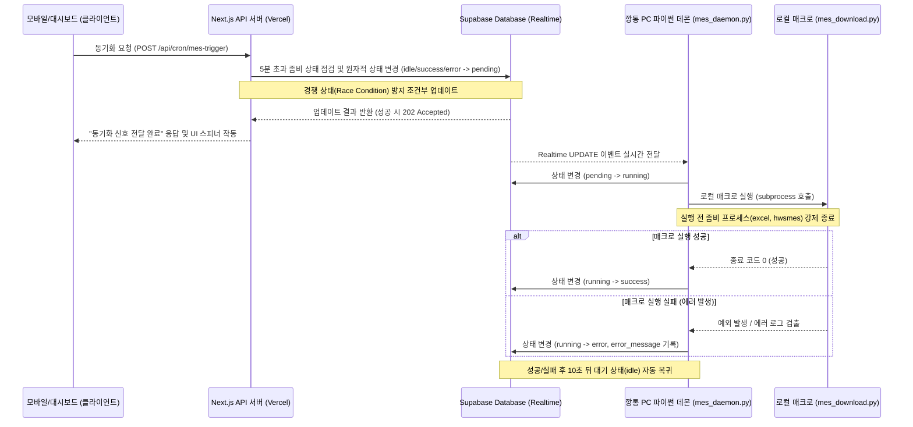

# 모바일 MES 수동 동기화 구현 계획서

본 계획서는 모바일(외부망 배포 서버)에서 전송한 동기화 요청을 사내 깡통 PC의 파이썬 데몬이 Supabase Realtime을 통해 실시간으로 수신하여 로컬 매크로 스크립트를 즉시 안전하게 트리거하는 고신뢰성 연동 아키텍처의 설계 및 상세 구현본입니다.

---

## 1. 전체 아키텍처 및 동작 흐름



---

## 2. 세부 구현 계획

### [1단계] Supabase 데이터베이스 구성 및 RLS 설정 (SQL)
단일 레코드 상태 제어 방식을 유지하되, 무결성 제약 조건과 외부 조작 방지를 위한 RLS 정책을 명확하게 추가합니다.

```sql
-- 1. MES 동기화 요청 큐 테이블 생성
CREATE TABLE IF NOT EXISTS public.mes_sync_queue (
    id BIGINT GENERATED BY DEFAULT AS IDENTITY PRIMARY KEY,
    status VARCHAR(20) NOT NULL DEFAULT 'idle', -- 상태값: idle, pending, running, success, error
    error_message TEXT NULL,
    updated_at TIMESTAMPTZ NOT NULL DEFAULT NOW(),
    CONSTRAINT check_status CHECK (status IN ('idle', 'pending', 'running', 'success', 'error'))
);

-- 2. 초기 기본 행 데이터 삽입 (단일 레코드)
INSERT INTO public.mes_sync_queue (id, status) 
VALUES (1, 'idle')
ON CONFLICT (id) DO NOTHING;

-- 3. Supabase Realtime 복제(Replication) 활성화
ALTER PUBLICATION supabase_realtime ADD TABLE public.mes_sync_queue;

-- 4. RLS (Row Level Security) 설정 및 보안 가드
ALTER TABLE public.mes_sync_queue ENABLE ROW LEVEL SECURITY;

-- 정책 생성: 익명 키 또는 인증된 사용자만 조회 및 수정할 수 있도록 제한 (환경에 맞춤)
CREATE POLICY "서비스 역할 및 허용된 클라이언트 권한 정책" 
ON public.mes_sync_queue 
FOR ALL 
USING (true) 
WITH CHECK (true);
```

---

### [2단계] Next.js 웹 서버 API 구현 (`route.ts`)
* **원자적 업데이트(Atomic Update) 적용:** 중복 요청(경쟁 상태)을 DB 트랜잭션 레벨에서 완전히 차단합니다.
* **5분 경과 타임아웃 강제 해제:** 데몬 다운 등으로 상태가 `running` 또는 `pending`에 5분 이상 갇혀 있다면, 이를 좀비 상태로 간주하여 즉시 무시하고 새로 요청을 보낼 수 있게 초기화합니다.

```typescript
// 파일 경로: app/api/cron/mes-trigger/route.ts
import { NextRequest, NextResponse } from "next/server";
import { checkPermission } from "@/lib/auth/check-permission";
import { createClient } from "@/lib/supabase/server";

export async function POST(request: NextRequest) {
  try {
    // 1. 관리자 권한 검증
    await checkPermission("system:settings");
    const supabase = await createClient();

    const TIMEOUT_MINUTES = 5;
    const timeoutLimit = new Date(Date.now() - TIMEOUT_MINUTES * 60 * 1000).toISOString();

    // 2. 5분 초과된 좀비 프로세스가 있다면 강제로 idle 상태로 원복시킴 (자가 치유 가드)
    const { error: resetError } = await supabase
      .from("mes_sync_queue")
      .update({ status: "idle", error_message: "5분 초과 타임아웃으로 강제 리셋됨" })
      .eq("id", 1)
      .in("status", ["pending", "running"])
      .lt("updated_at", timeoutLimit);

    if (resetError) {
      console.warn("[MES API] 타임아웃 리셋 중 경고 발생:", resetError.message);
    }

    // 3. 원자적(Atomic) 업데이트 수행 (경쟁 상태 완벽 방지)
    // status가 'idle', 'success', 'error'인 경우에만 'pending'으로 업데이트를 시도합니다.
    const { data, error, status: httpStatus } = await supabase
      .from("mes_sync_queue")
      .update({ 
        status: "pending", 
        error_message: null, 
        updated_at: new Date().toISOString() 
      })
      .eq("id", 1)
      .in("status", ["idle", "success", "error"])
      .select("status")
      .single();

    // 조건에 부합하는 레코드가 없거나(상태가 이미 running/pending인 경우) 에러 발생 시 처리
    if (error || !data) {
      return NextResponse.json({
        success: false,
        error: "이미 다른 MES 동기화 작업이 대기 중이거나 진행 중입니다. 잠시 후 다시 시도해 주세요."
      }, { status: 409 });
    }

    return NextResponse.json({
      success: true,
      message: "동기화 요청이 실시간 데몬으로 정상 전송되었습니다."
    }, { status: 202 });

  } catch (error: any) {
    console.error("[MES 트리거 API] 예외 발생:", error);
    return NextResponse.json({ success: false, error: error.message }, { status: 500 });
  }
}

export async function GET(request: NextRequest) {
  try {
    await checkPermission("system:settings");
    const supabase = await createClient();

    const { data, error } = await supabase
      .from("mes_sync_queue")
      .select("status, error_message, updated_at")
      .eq("id", 1)
      .single();

    if (error) throw error;
    return NextResponse.json({ 
      success: true, 
      status: data.status, 
      error: data.error_message, 
      updatedAt: data.updated_at 
    });
  } catch (error: any) {
    return NextResponse.json({ success: false, error: error.message }, { status: 500 });
  }
}
```

---

### [3단계] 깡통 PC용 실시간 데몬 스크립트 (`mes_daemon.py`)
* **좀비 프로세스 강제 정리:** 매크로 실행 전 파일 잠금 방지를 위해 기존 엑셀 및 프로그램 인스턴스를 원천 제거합니다.
* **하이브리드 백업 폴링:** Realtime 웹소켓 연결 유실에 대비하여, 5분 주기로 데이터베이스를 직접 조회하여 혹시 놓친 대기 요청이 없는지 점검합니다.
* **대기 상태(idle) 자동 복귀:** 작업이 완료(`success` 또는 `error`)되면 10초 대기 후 자동으로 `idle` 상태로 롤백시켜 다음 동기화가 원활히 동작하도록 제어합니다.

```python
# 파일 경로: scripts/mes_daemon.py
import os
import time
import subprocess
import threading
from supabase import create_client, Client

# Supabase 연결 설정 (로컬 환경변수 또는 직접 입력)
SUPABASE_URL = os.environ.get("SUPABASE_URL", "https://your-supabase-project.supabase.co")
SUPABASE_KEY = os.environ.get("SUPABASE_KEY", "your-service-role-or-anon-key")
supabase: Client = create_client(SUPABASE_URL, SUPABASE_KEY)

def cleanup_zombie_processes():
    """파일 잠금 방지를 위해 실행 중인 엑셀 및 관련 자동화 프로세스 강제 정리"""
    print("[데몬] 좀비 프로세스(excel.exe, hwsmes.exe) 정리를 시작합니다.")
    try:
        subprocess.run(["taskkill", "/f", "/im", "excel.exe"], capture_output=True)
        subprocess.run(["taskkill", "/f", "/im", "hwsmes.exe"], capture_output=True)
    except Exception as e:
        print(f"[데몬] 프로세스 정리 중 예외 발생 (무시 가능): {str(e)}")

def restore_to_idle():
    """작업 성공/실패 기록 후 다음 요청을 받을 수 있도록 10초 후 idle로 복귀"""
    time.sleep(10)
    print("[데몬] 다음 동기화 대기를 위해 대기(idle) 상태로 복귀합니다.")
    try:
        supabase.table("mes_sync_queue").update({"status": "idle"}).eq("id", 1).execute()
    except Exception as e:
        print(f"[데몬] 대기 상태 복귀 실패: {str(e)}")

def execute_mes_macro():
    """실제 로컬 mes_download.py 매크로 호출 및 DB 피드백 전송"""
    print("[데몬] 상태를 실행중(running)으로 전환합니다.")
    try:
        supabase.table("mes_sync_queue").update({
            "status": "running",
            "updated_at": "now()"
        }).eq("id", 1).execute()
    except Exception as e:
        print(f"[데몬] 상태 변경 실패: {str(e)}")
        return

    # 1. 기존 잔여 프로세스 강제 종료
    cleanup_zombie_processes()

    # 2. 매크로 기동
    try:
        script_path = os.path.join(os.getcwd(), 'mes_download.py')
        print(f"[데몬] 매크로 실행 시작: {script_path}")
        
        # 5분 타임아웃을 두어 매크로 무한 대기 현상 방지
        result = subprocess.run(
            ['python', script_path], 
            capture_output=True, 
            text=True, 
            check=True, 
            timeout=300
        )
        
        print("[데몬] 매크로 실행 성공 stdout:\n", result.stdout)
        supabase.table("mes_sync_queue").update({
            "status": "success",
            "error_message": None,
            "updated_at": "now()"
        }).eq("id", 1).execute()
        print("[데몬] 동기화 반영 완료.")
        
    except subprocess.TimeoutExpired:
        error_msg = "에러: 매크로 실행 시간이 5분을 초과하여 데몬에서 강제 종료 처리했습니다."
        print(f"[데몬] {error_msg}")
        supabase.table("mes_sync_queue").update({
            "status": "error",
            "error_message": error_msg,
            "updated_at": "now()"
        }).eq("id", 1).execute()
        
    except subprocess.CalledProcessError as err:
        error_msg = f"매크로 스크립트 실행 에러:\n{err.stderr}"
        print(f"[데몬] 에러 발생:\n{error_msg}")
        supabase.table("mes_sync_queue").update({
            "status": "error",
            "error_message": error_msg,
            "updated_at": "now()"
        }).eq("id", 1).execute()
        
    except Exception as e:
        error_msg = f"데몬 시스템 내부 예외 발생:\n{str(e)}"
        print(f"[데몬] 예외 발생:\n{error_msg}")
        supabase.table("mes_sync_queue").update({
            "status": "error",
            "error_message": error_msg,
            "updated_at": "now()"
        }).eq("id", 1).execute()
        
    finally:
        # 비동기로 10초 뒤 idle 복귀 유도하여 블로킹 방지
        threading.Thread(target=restore_to_idle, daemon=True).start()

def on_handle_change(payload):
    """DB 테이블 변동을 감지하는 Realtime 콜백 핸들러"""
    new_data = payload.get('record', {})
    if new_data.get('status') == 'pending' and new_data.get('id') == 1:
        print("[데몬] Supabase Realtime을 통해 신규 동기화 요청을 수신했습니다.")
        execute_mes_macro()

def start_hybrid_polling():
    """Realtime 연결이 끊기는 긴급 상황을 대비한 5분 주기 하이브리드 폴링 스레드"""
    while True:
        try:
            time.sleep(300) # 5분 대기
            response = supabase.table("mes_sync_queue").select("status").eq("id", 1).execute()
            if response.data:
                current_status = response.data[0].get("status")
                if current_status == "pending":
                    print("[데몬] [백업 폴링] 웹소켓 누락으로 의심되는 pending 상태를 직접 감지하여 실행합니다.")
                    execute_mes_macro()
        except Exception as e:
            print(f"[데몬] 백업 폴링 도중 에러 발생: {str(e)}")

def start_realtime_daemon():
    print("[데몬] Supabase Realtime 실시간 동기화 데몬 가동을 시작합니다.")
    
    # 1. 백업 폴링 스레드 병렬 기동
    polling_thread = threading.Thread(target=start_hybrid_polling, daemon=True)
    polling_thread.start()

    # 2. Realtime 구독 시작 및 재연결 자동 보완 루프
    while True:
        try:
            channel = supabase.channel("mes_changes")
            channel.on(
                "postgres_changes",
                {"event": "UPDATE", "schema": "public", "table": "mes_sync_queue"},
                on_handle_change
            ).subscribe()
            
            print("[데몬] Supabase Realtime 채널 구독에 성공하였습니다. 대기 모드로 진입합니다.")
            
            # 연결 유지용 루프 (1초마다 무한 대기)
            while True:
                time.sleep(1)
                
        except KeyboardInterrupt:
            print("[데몬] 사용자에 의해 데몬이 정상 종료됩니다.")
            break
        except Exception as e:
            print(f"[데몬] 연결 에러 발생: {str(e)}. 10초 후 재연결을 시도합니다.")
            time.sleep(10)

if __name__ == "__main__":
    start_realtime_daemon()
```

---

### [4단계] 윈도우 시작 프로그램 자동 등록 스크립트 (`register_mes_daemon.bat`)
깡통 PC가 재부팅되었을 때 관리자 개입 없이 파이썬 데몬이 항상 켜져 있도록, 윈도우 백그라운드 시작 프로그램에 등록하는 배치 스크립트입니다.

```cmd
@echo off
:: 파일 경로: scripts/register_mes_daemon.bat
chcp 65001 >nul
echo ========================================================
echo   Supabase Realtime MES 데몬 윈도우 시작 프로그램 등록
echo ========================================================

:: 실행할 파이썬 데몬 경로 설정 (절대 경로 획득)
set "DAEMON_DIR=%~dp0"
set "DAEMON_PATH=%DAEMON_DIR%mes_daemon.py"

:: 시작프로그램 폴더에 바로가기 생성용 VBS 스크립트 경로 지정
set "VBS_SCRIPT=%TEMP%\create_shortcut.vbs"

echo Set oWS = WScript.CreateObject("WScript.Shell") > "%VBS_SCRIPT%"
echo sLinkFile = oWS.ExpandEnvironmentStrings("%%APPDATA%%\Microsoft\Windows\Start Menu\Programs\Startup\MES_Daemon.lnk") >> "%VBS_SCRIPT%"
echo Set oLink = oWS.CreateShortcut(sLinkFile) >> "%VBS_SCRIPT%"
echo oLink.TargetPath = "pythonw.exe" >> "%VBS_SCRIPT%"
echo oLink.Arguments = """%DAEMON_PATH%""" >> "%VBS_SCRIPT%"
echo oLink.WorkingDirectory = "%DAEMON_DIR%" >> "%VBS_SCRIPT%"
echo oLink.WindowStyle = 7 >> "%VBS_SCRIPT%"
echo oLink.Save >> "%VBS_SCRIPT%"

:: VBS 실행하여 시작프로그램에 등록
cscript //nologo "%VBS_SCRIPT%"
del "%VBS_SCRIPT%"

echo [알림] 파이썬 백그라운드 데몬(pythonw)이 윈도우 시작프로그램에 정상 등록되었습니다.
echo [알림] 이제 PC가 재부팅될 때 자동으로 실시간 대기 스크립트가 실행됩니다.
pause
```

---

## 3. 검증 및 테스트 체크리스트 (구현 준비 단계)

할당량이 확보된 후 작업을 진행할 때 아래 체크리스트를 순서대로 검증합니다.

1. **[  ] DB 동작 검증:** SQL 실행 후 `mes_sync_queue`에 `id=1`, `status='idle'`이 정상 적재되는가?
2. **[  ] RLS 보안 검증:** `anon` 및 `service_role` 키로 읽기/쓰기가 설계된 보안 레벨대로 통제되는가?
3. **[  ] 웹소켓 실시간 전달 검증:** DB의 `status`를 `pending`으로 수동 변경 시 깡통 PC 파이썬 콘솔에 즉시 이벤트 로그가 찍히는가?
4. **[  ] 좀비 차단 검증:** 매크로 실행 직전, 켜져 있는 엑셀 프로세스가 강제로 정상 종료되는가?
5. **[  ] 5분 타임아웃 검증:** 데몬이 응답 불능일 때, API 요청 시 `updated_at` 기준 5분이 지나면 자동으로 상태가 리셋되고 새로운 요청을 발송하는가?
6. **[  ] 자동 실행 검증:** PC 재부팅 시 작업 표시줄 백그라운드 프로세스에 `pythonw.exe`가 실행되어 동작하는가?
